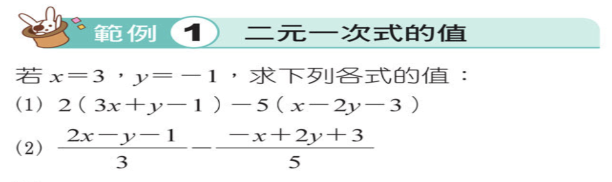

---
markmap:
  color:
    - blue
  initialExpandLevel: 4
  # other options
---

# [go back](../index.html)
# 4.1 二元一次方程式
## 範例
- 範例1 
  - 
- 範例2 
  - 
# [範例](範例/index.html)
## [範例2](範例/範例2/index.html)
## [範例5](範例/範例5/index.html)
## [範例4](範例/範例4/index.html)
## [範例3](範例/範例3/index.html)
## [範例6](範例/範例6/index.html)
## [範例1](範例/範例1/index.html)
## [精熟1](範例/精熟1/index.html)
