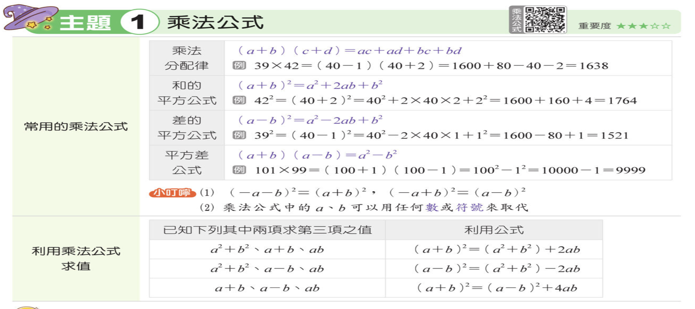

---
markmap:
  color:
    - blue
  initialExpandLevel: 4
  # other options
---

# [go back](../index.html)
# 乘法公式
- 
- **乘法分配律公式**  
  \[(a+b)(c+d) = ac + ad + bc + bd\]  

- **和的平方公式**  
  \[(a+b)^2 = a^2 + 2ab + b^2\]  

- **差的平方公式**  
  \[(a-b)^2 = a^2 - 2ab + b^2\]  

- **平方差公式**  
  \[(a+b)(a-b) = a^2 - b^2\]  

- **注意事項**  
  - \((-a-b)^2 = (a+b)^2\)  
  - \((-a+b)^2 = (a-b)^2\)  
  - 公式中的 \(a\)、\(b\) 可代入任何數或符號  

- **利用乘法公式求值範例**  
  - 已知 \(a^2+b^2\)、\(a+b\) 可求 \(ab\)：  
    \[(a+b)^2 = (a^2+b^2) + 2ab\]  
  - 已知 \(a^2+b^2\)、\(a-b\) 可求 \(ab\)：  
    \[(a-b)^2 = (a^2+b^2) - 2ab\]  
  - 已知 \(a+b\)、\(a-b\) 可求 \(ab\)：  
    \[(a+b)^2 = (a-b)^2 + 4ab\]  

# 範例
## **範例 1** 利用分配律求值
```
利用分配律計算下列各式的值：
1. 34 × 487
2. 29 6/7 × 28 1/5
```
